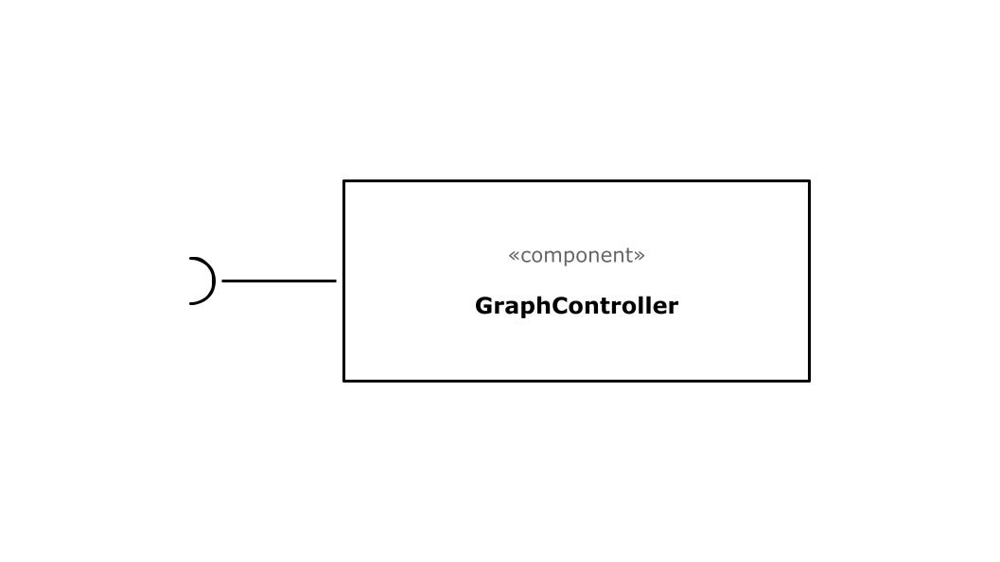
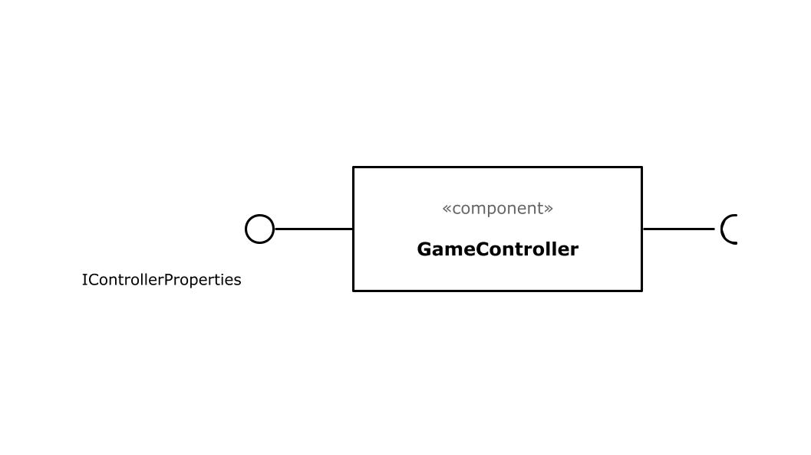
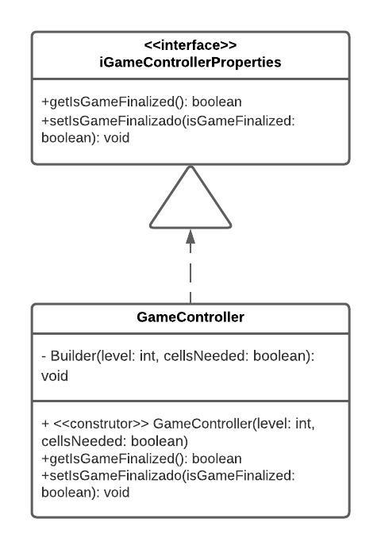
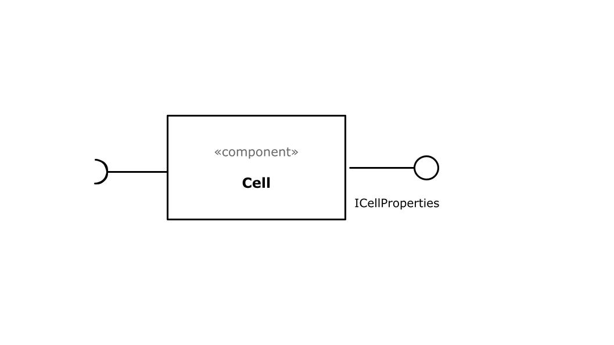
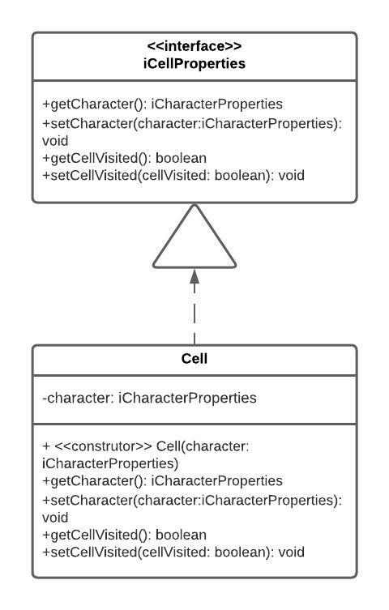
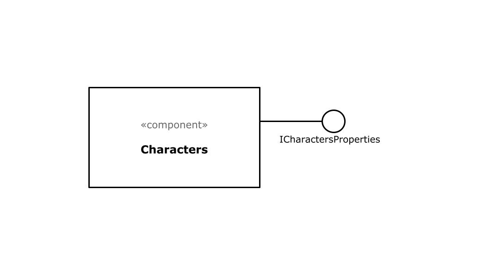
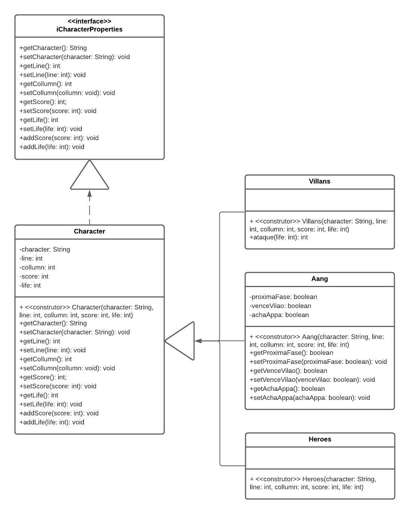
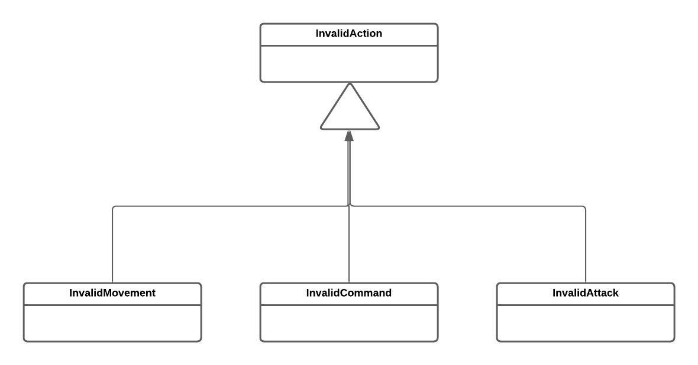

# Apresentação Parcial do Projeto

# Estrutura de Arquivos e Pastas

~~~
├── README.md          <- apresentação do projeto
│
├── data               <- dados usados pelo jogo (se houver)
│
├── src                <- projeto em Java (IntelliJ)
│   │
│   ├── src            <- arquivos-fonte do projeto (.java)
│   │
│   ├── out            <- arquivos em bytecode (.class)
│   │
│   └── README.md      <- instruções básicas de instalação/execução
│
└── assets             <- mídias usadas no projeto
~~~

## `data`

Aqui ficarão os arquivos de dados usados no projeto. Como, por exemplo, os arquivos .txt que serão usados para a criação de mapas.

## `src`

Projeto em Java, utilizamos a IDE IntelliJ, incluindo todos os arquivos de dados e bibliotecas necessários para a sua execução.

## `assets`

Aqui ficarão as mídias do projeto: vídeo, imagens, animações, slides etc.

# Projeto `Avatar-Escape`

# Descrição Resumida do Projeto/Jogo

> O Avatar Aang precisa manter o equílibro, no entanto, a Nação do Fogo possui outros planos. Aang precisa passar por alguns de seus inimigos, com a ajuda de seus amigos, até enfrentar o Senhor do Fogo Ozai e, finalmente, acabar com a tirania da Nação do Fogo sobre o mundo.

# Equipe: Homem-Sereia e Mexilhãozinho
* `Beatriz Iamauchi Barroso` - `166531`
* `Pedro Igor Salvador Alves` - `187044`

# Vídeos do Projeto

## Vídeo da Prévia
[Link para o Vídeo da Prévia do Jogo](../arquivos-apresentacao/Video-Previa.mp4)

# Slides do Projeto

## Slides da Prévia
[Link para os Slides da Prévia do Jogo](../arquivos-apresentacao/Slides-Previa.pdf)

# Documentação dos Componentes

# Diagramas

## Diagrama Geral do Projeto

## Diagrama Geral de Componentes

Este é o diagrama compondo componentes para análise:

## Componente `GraphController`

> Ainda iremos fazer, mas demonimamos como componente graphController a classe descrita a seguir. Este componente é responsável pelo controle dos gráficos do jogo.

**Ficha Técnica**

item | Detalhamento
----- | -----
Classe | `src.GraphControllerComponent`
Autores | `Beatriz Iamauchi Barroso`   `Pedro Igor Salvador Alves`
Interfaces | 

### Interfaces

Interfaces associadas a esse componente:

`Não há interfaces atreladas a este componente.`

## Componente `GameController`

> Demonimamos como componente gameController uma classe e uma interface descrita a seguir. Este componente é responsável pelo controle geral do jogo.

**Ficha Técnica**

item | Detalhamento
----- | -----
Classe | `src.GameControllerComponent`
Autores | `Beatriz Iamauchi Barroso`   `Pedro Igor Salvador Alves`
Interfaces | `iControllerProperties`

### Interfaces

Interfaces associadas a esse componente:

## Componente `Cell`

> Demonimamos como componente cell uma classe e uma interface descrita a seguir. Este componente é responsável por agregar um personagem do jogo e seus atributos.

**Ficha Técnica**

item | Detalhamento
----- | -----
Classe | `src.CellComponent`
Autores | `Beatriz Iamauchi Barroso`   `Pedro Igor Salvador Alves`
Interfaces | `iCellProperties`

### Interfaces

Interfaces associadas a esse componente:

## Componente `Character`

> Demonimamos como componente character uma classe e uma interface descrita a seguir. Este componente é responsável por agregar as informações de cada personagem do jogo, como nome, dano, etc.

**Ficha Técnica**

item | Detalhamento
----- | -----
Classe | `src.CharacterComponent`
Autores | `Beatriz Iamauchi Barroso`   `Pedro Igor Salvador Alves`
Interfaces | `iCharacterProperties`

### Interfaces

Interfaces associadas a esse componente:

## Detalhamento das Interfaces

### Interface `iCellproperties`

Define e altera o personagem da célula, assim como informa se a célula ja foi visitada ou não.
~~~java
public interface iCellProperties {
    iCharacterProperties getCharacter();
    void setCharacter(iCharacterProperties character);
    boolean getCellVisited();
    void setCellVisited(boolean cellVisited);
}
~~~

Método | Objetivo
-------| --------
`getCharacter` | Retorna o personagem que está na célula.
`setCharacter` | Altera o personagem que está na célula.
`getCellVisited` | Informa se a célula já foi visitada ou não.
`setCellVisited` | Altera a informação de se a célula já foi visitada ou não.

### Interface `iCharacterproperties`

Informa e altera os atributos de um personagem.
~~~java
public interface iCharacterProperties {
    public String getCharacter();
    public void setCharacter(String character);
    public int getLine();
    public void setLine(int line);
    public int getCollumn();
    public void setCollumn(int collumn);
    public int getScore();
    public void setScore(int score);
    public int getLife();
    public void setLife(int life);
    public void addScore(int score);
    public void addLife(int life);
}
~~~

Método | Objetivo
-------| --------
`getCharacter` | Retorna o nome personagem que está na célula.
`setCharacter` | Altera o nome personagem que está na célula.
`getLine` | Retorna a linha que o personagem se encontra.
`setLine` | Altera a linha que o personagem se encontra.
`getCollumn` | Retorna a coluna que o personagem se encontra.
`setCollumn` | Altera a coluna que o personagem se encontra.
`getScore` | Retorna o quanto o personagem altera o Estado Avatar do Aang.
`setScore` | Altera o quanto o personagem altera o Estado Avatar do Aang.
`getLife` | Retorna o quanto o personagem altera a Vida do Aang.
`setLife` | Altera o quanto o personagem altera a Vida do Aang.
`addScore` | Altera o indicador de Estado Avatar do Aang.
`addLife` | Altera o indicador de Vida do Aang.

# Plano de Exceções

## Diagrama da hierarquia de exceções

## Descrição das classes de exceção

Classe | Descrição
----- | -----
InvalidAction | Engloba todas as exceções de ações não aceitas.
InvalidMovement | Indica que o movimento para fora do tabuleiro é inútil.
InvalidCommand | Indica a ação feita com uma tecla inválida é inútil na fase de tabuleiro.
InvalidAttack | Indica a ação feita com uma tecla inválida é inútil na fase de batalha com vilão.