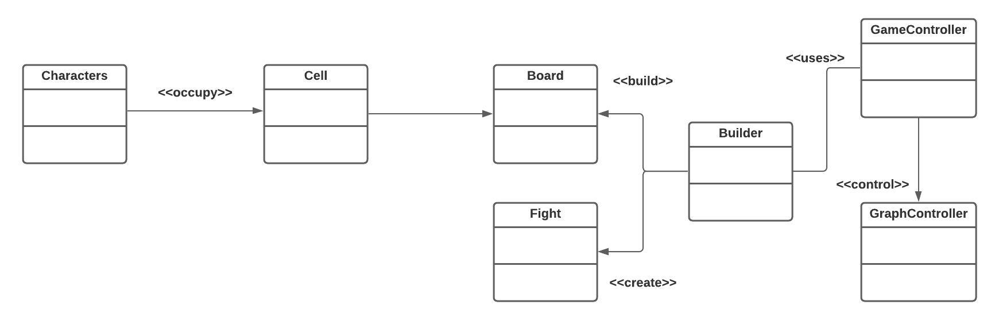
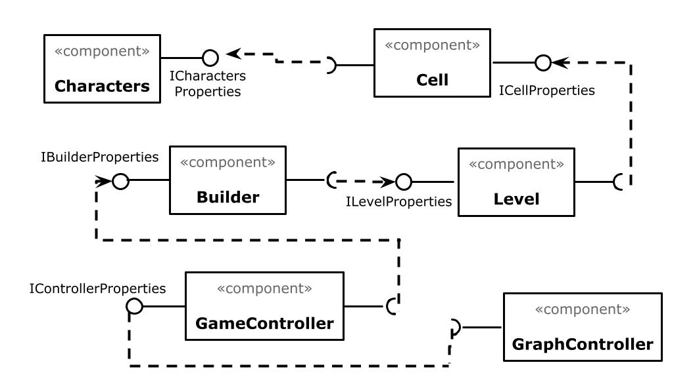
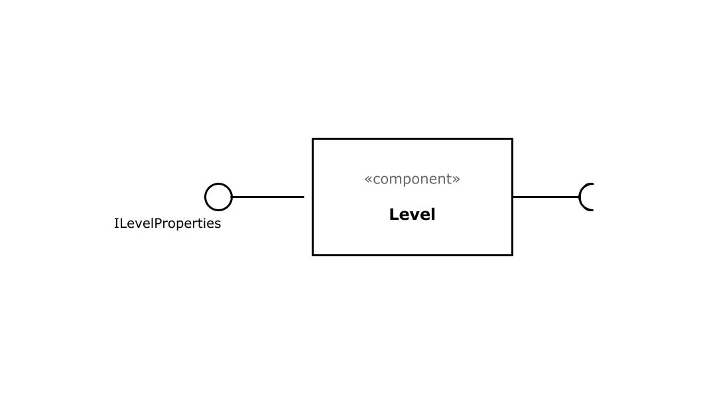
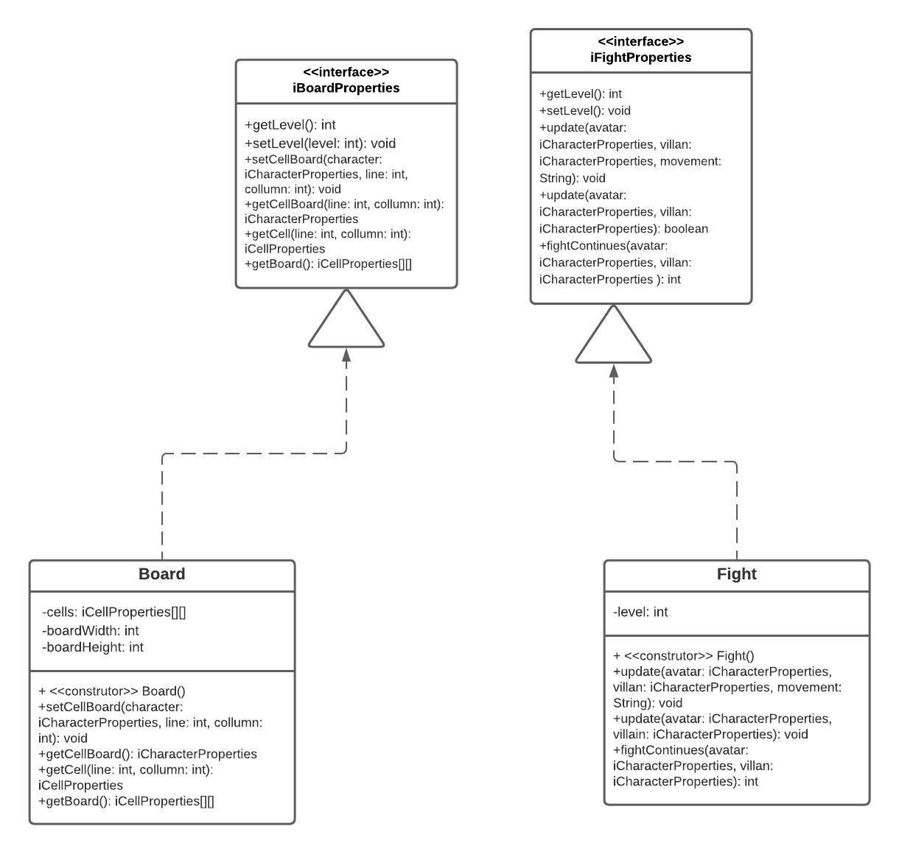

# Apresentação Parcial do Projeto

# Estrutura de Arquivos e Pastas

~~~
├── README.md          <- apresentação do projeto
│
├── data               <- dados usados pelo jogo (se houver)
│
├── src                <- projeto em Java (IntelliJ)
│   │
│   ├── src            <- arquivos-fonte do projeto (.java)
│   │
│   ├── out            <- arquivos em bytecode (.class)
│   │
│   └── README.md      <- instruções básicas de instalação/execução
│
└── assets             <- mídias usadas no projeto
~~~

## `data`

Aqui ficarão os arquivos de dados usados no projeto. Como, por exemplo, os arquivos .txt que serão usados para a criação de mapas.

## `src`

Projeto em Java, utilizamos a IDE IntelliJ, incluindo todos os arquivos de dados e bibliotecas necessários para a sua execução.

## `assets`

Aqui ficarão as mídias do projeto: vídeo, imagens, animações, slides etc.

# Projeto `Avatar-Escape`

# Descrição Resumida do Projeto/Jogo

> O Avatar Aang precisa manter o equílibro, no entanto, a Nação do Fogo possui outros planos. Aang precisa passar por alguns de seus inimigos, com a ajuda de seus amigos, até enfrentar o Senhor do Fogo Ozai e, finalmente, acabar com a tirania da Nação do Fogo sobre o mundo.

# Equipe: Homem-Sereia e Mexilhãozinho
* `Beatriz Iamauchi Barroso` - `166531`
* `Pedro Igor Salvador Alves` - `187044`

# Vídeos do Projeto

## Vídeo da Prévia
[Link para o Vídeo da Prévia do Jogo](../arquivos-apresentacao/Video-Previa.mp4)

# Slides do Projeto

## Slides da Prévia
[Link para os Slides da Prévia do Jogo](../arquivos-apresentacao/Slides-Previa.pdf)

# Documentação dos Componentes

# Diagramas

## Diagrama Geral do Projeto

## Diagrama Geral de Componentes

Este é o diagrama compondo componentes para análise:

## Componente `Level`

> Demonimamos como componente level um conjunto de classes e interfaces descritas a seguir. Este componente é responsável por agregar as células de um tabuleiro e seus atributos ou a criação da luta com o vilão da fase.

**Ficha Técnica**

item | Detalhamento
----- | -----
Classe | `src.LevelComponent`
Autores | `Beatriz Iamauchi Barroso`   `Pedro Igor Salvador Alves`
Interfaces | `iBoardProperties`   `iFightProperties`

### Interfaces

Interfaces associadas a esse componente:

## Componente `Level`

> Demonimamos como componente level um conjunto de classes e interfaces descritas a seguir. Este componente é responsável por agregar as células de um tabuleiro e seus atributos ou a criação da luta com o vilão da fase.

**Ficha Técnica**

item | Detalhamento
----- | -----
Classe | `src.LevelComponent`
Autores | `Beatriz Iamauchi Barroso`   `Pedro Igor Salvador Alves`
Interfaces | `iBoardProperties`   `iFightProperties`

### Interfaces

Interfaces associadas a esse componente:

## Detalhamento das Interfaces

### Interface `<nome da interface>`

`<Resumo do papel da interface.>`

~~~
<Interface em Java.>
~~~

Método | Objetivo
-------| --------
`<id do método em Java>` | `<objetivo do método e descrição dos parâmetros>`

## Exemplo:

### Interface `ITableProducer`

Interface provida por qualquer fonte de dados que os forneça na forma de uma tabela.

~~~java
public interface ITableProducer {
  String[] requestAttributes();
  String[][] requestInstances();
}
~~~

Método | Objetivo
-------| --------
`requestAttributes` | Retorna um vetor com o nome de todos os atributos (colunas) da tabela.
`requestInstances` | Retorna uma matriz em que cada linha representa uma instância e cada coluna o valor do respectivo atributo (a ordem dos atributos é a mesma daquela fornecida por `requestAttributes`.

### Interface `IDataSetProperties`

Define o recurso (usualmente o caminho para um arquivo em disco) que é a fonte de dados.

~~~java
public interface IDataSetProperties {
  public String getDataSource();
  public void setDataSource(String dataSource);
}
~~~

Método | Objetivo
-------| --------
`getDataSource` | Retorna o caminho da fonte de dados.
`setDataSource` | Define o caminho da fonte de dados, informado através do parâmetro `dataSource`.

# Plano de Exceções

## Diagrama da hierarquia de exceções
`<Elabore um diagrama com a hierarquia de exceções como detalhado abaixo>`

## Descrição das classes de exceção

`<Monte uma tabela descritiva seguindo o exemplo>:`

Classe | Descrição
----- | -----
DivisaoInvalida | Engloba todas as exceções de divisões não aceitas.
DivisaoInutil | Indica que a divisão por 1 é inútil.
DivisaoNaoInteira | Indica uma divisão não inteira.